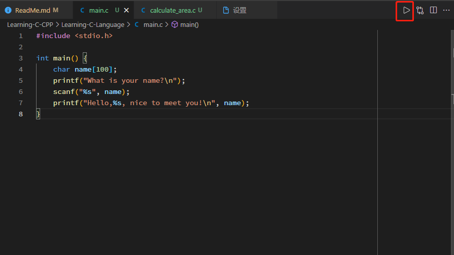
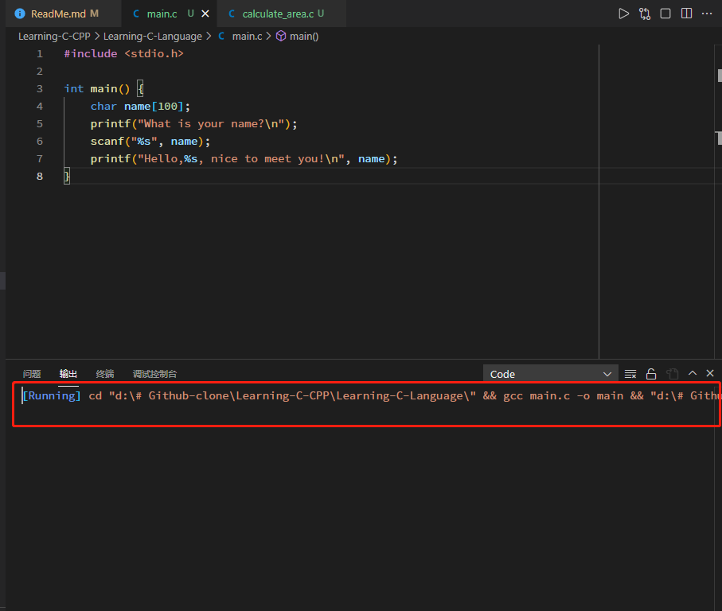

# Learning C


## New Words
- **minimalist /'mɪnɪm(ə)lɪst/** adj.极简主义的  n.极简主义者


CMake(Cross platform Make) 是个一个开源的跨平台自动化建构系统，用来管理软件建置的程序，并不相依于某特定编译器。并可支持多层目录、多个应用程序与多个库。 它用配置文件控制建构过程（build process）的方式和Unix的make相似，只是CMake的配置文件取名为 CMakeLists.txt。CMake并不直接建构出最终的软件，而是产生标准的建构档（如Unix的 Makefile 或 Windows Visual C++的projects/workspaces），然后再依一般的建构方式使用。这使得熟悉某个集成开发环境（IDE）的开发者可以用标准的方式建构他的软件，这种可以使用各平台的原生建构系统的能力是CMake和SCons等其他类似系统的区别之处。 CMake配置文件(CMakeLists.txt)可设置源代码或目标程序库的路径、产生适配器（wrapper）、还可以用任意的顺序建构可执行文件。CMake支持in-place建构（二进档和源代码在同一个目录树中）和 out-of-place 建构（二进档在别的目录里），因此可以很容易从同一个源代码目录树中建构出多个二进档。CMake也支持静态与动态程序库的建构。虽然名字中含有"make"，但是CMake和Unix上常见的“make”系统是分开的，而且更为高端。 它可与原生建置环境结合使用，例如：make、苹果的 Xcode 与微软的 Visual Studio。


## Windows 下配置 C 程序开发环境:

### 1. 安装 MinGW 
**提示：** MinGW 的读法 `min ge wei`

MinGW (Minimalist GNU For Windows) 是一个精简的 Windows 平台 C/C++, ADA 及 Fortran 编译器，相比 Cygwin 而言，体积要小很多，使用较为方便。

MinGW 最大的特点就是编译出来的可执行文件能够独立在 Windows 上运行。

MinGW 的组成：
- (1) 编译器(支持 C、C++、ADA、Fortran)
- (2) GNU 工具
- (3) mingw-get(用于 windows 平台安装和部署 MinGW 和 MSYS 的命令行安装器)
- (4) mingw-get-inst(用于 GUI 打包)

#### 1.1 下载 MinGW
下载地址： https://sourceforge.net/projects/mingw-w64/

下载、解压、重命名之后我放在 D 盘根目录里 `D:\mingw64`

#### 1.2 配置系统变量
进入 `mingw64` 文件夹下的 `bin` 文件夹，并复制路径 `D:\mingw64\bin`

找到桌面 `此电脑` 右键 `属性` --> `高级系统设置` --> `环境变量` --> `系统变量` --> `Path`， 如果是 win7 就在 path 的值只后面粘贴 `;D:\mingw64\bin`;  Win10 直接粘贴路径 `D:\mingw64\bin`

#### 1.3 验证 MinGW 安装成功与否

`Win + R` 打开运行弹框，输入 `cmd` 或 `powershell` 在黑色弹框中输入 `gcc -v`, 出现如下代码即表示安装成功
```
Using built-in specs.
COLLECT_GCC=D:\mingw64\bin\gcc.exe
...
...
...
gcc version 8.1.0 <x86_64-posix-sjlj-rev0, Built by MinGW-64 project>
```

### 2. Visual Studio Code 中写 C 程序的环境配置

#### 2.1 安装插件

1. C/C++ 
2. Code Runner

#### 2.2 编译运行程序
编译运行程序介绍两种方法
- (1) 使用之前安装好的 Code Runner 插件一键编译运行程序
- (2) 打开vscode的集成终端使用命令行编译和运行。(tip：也可以直接打开文件所在的文件夹，按住 `shift` 键， 点击鼠标右键点击 `在此处运行命令行窗口`/`Git Bash Here`)

比如运行下面的 `main.c` 文件：
```c
#include <stdio.h>

int main() {
    char name[100];
    printf("What is your name?\n");
    scanf("%s", name);
    printf("Hello,%s, nice to meet you!\n", name);
}
```
在 VSCode 中打开点击右上角的 Code Runner 插件对应的三角图标运行



但会出现下面这种情况



程序段中使用了`scanf`函数从键盘读取一串字符，这时无法输入数据，也无法结束程序，需要重启一下 VSCode。

然后依次打开：**文件 > 首选项 > 设置 > 用户 > 拓展 > Run Code Configuration** 找到**`Run In Terminal`**勾选。

现在程序已经可以正常运行了，此时程序是运行在vscode的集成终端上，并不会额外弹出一个外部窗口。

tip: 如果想在终端中自行编译此文件的语句为： `gcc mian.c -o main.exe`

点击右上角的**垃圾桶**图标可以直接结束程序运行并关闭集成终端。

**替补插件：**编译运行C/C++也可以选择`C/C++ Compile Run`插件，按f6一键运行

相较于`code runner`，`C/C++ Compile Run`插件在勾选上: 文件 > 首选项 > 设置 > 扩展 > Compile Run Configuration的`Run-in-external-terminal`选项后可以出现和 dev / codeblocks / vc一样的外部窗口

还有一种其他的错误情况，想查看请参考这篇文章：[windows 10上使用vscode编译运行和调试C/C++](https://zhuanlan.zhihu.com/p/77645306)

#### 2.3 vscode输出窗口中文乱码

> https://amahv.github.io/2020/06/24/vscode-shu-chu-chuang-kou-zhong-wen-luan-ma/


### CLion 中安装步骤

- 安装 CLion 并[破解](https://blog.csdn.net/weixin_41803874/article/details/83963997)。
- 安装 MinGW-w64
    + 打开 clion 的 setting --> Build, Execution, Deployment --> ToolChains  --> 
    点击右侧的 Download --> 打开页面后，点击页面中的 Installation: 
    [Sourceforge](http://mingw-w64.org/doku.php/download/mingw-builds)
    + 安装第二个页面 Architecture: X86_64 然后点击下一步完成安装。
- 新建项目 选择 C Executable (注: 比如: Beginning-C。 
   **Notice: 新建项目名一定不要包含中文名, 如果含有中文项目创建后会报错。其次建立的新
   项目必须单独新开一个窗口，CLion 才会构建项目。**)
- Debugger 1: 如果下面的 Debug 中提示 "找不到 CMakeLists.txt" 的话点击后面的提示重新选择。
- Debugger 2: 如果 "sh.exe was found in your PATH ... " 出现这个错误提示， 那是因为
  在系统的环境变量中添加了 "C:\Program Files\Git\bin" 这个，移除就可以了。
- 在项目的同级目录中自动生成的 cmake-build-debug 是工程管理器(cmake) 自动生成的文件，不要删除。
  
  
  

## 不同后缀的文件

 - `#include <stdio.h> ` : C/C++ 程序的头文件 .h 为后缀。
 - `main.c` : C 程序的文件以 .c 为后缀
 - `main.cpp`: C++ 程序的文件以 .cpp 为后缀。( .cc 或 .cxx 为后缀的文件，是 C++ 源代码文件)


## [C、CPP文件是怎样运行起来的？](https://blog.csdn.net/m0_37925202/article/details/80907713)


## 面向过程 和 面向对象 的程序设计思想
 - 面向过程: "面向过程"是一种以事件为中心的编程思想。就是分解出解决问题所需要的步骤，然后用函数
    把这些步骤一步一步实现，使用的时候一个一个一次调用就可以了。
 - 面向对象: "面向对象" (Object Oriented, 简称 OO) 是一种以事物为中心的编程思想。

## C 语言 IDE 选择
 - 编辑器
    + 编写
    + 自动提示
    + 多文件编程
    + 查看多源文件
 - 编译器
    + 编译工具
    + 链接库
    + 工程管理器 (比如: clion 中使用的 CMake)
 - 调试器
    + 单步
    + 断点
    + 查看当前内存信息状态
 - 推荐的 IDE 环境
    + GNU (Linux)
        - vim
        - gcc
        - gdb
    + Windows
        - visual studio
        - MinGW (专门针对 windows 的工具集)
            + eclipse cdt 编辑器 (注: 需要配合 编译器)
            + codeblock 编辑器 (注: 需要配合 编译器)
            + dev c++
            + clion
    + Mac 
        - Xcode
        - clion (注: 首先要装 xcode)  


## C 语言注释
- 单行注释: //
- 多行注释: /**/

