# 这才是你最想要的 C++ 学习路线

[](https://www.zhihu.com/people/li-yan-29-40)

[Rocky0429](https://www.zhihu.com/people/li-yan-29-40)[](https://www.zhihu.com/question/48510028)

华东师范大学 软件工程硕士

98 人赞同了该文章

大家好，我是 Rocky0429。

对于零基础想要学学 C++ 的同学，我希望你们要先明白一件事：

> C++ 是一门极难掌握的编程语言，内容多且杂且难懂。

所以**如果你想要想要学好 C++，你要花很多的时间和精力。**

当然这件事我也想告诉你：如果你在刚开始学或者学了很短的一段时间，发现自己学不会，默默告诉自己“这不是我的原因，是 C++ 的原因，都赖它太难”。

我不希望同学们还没入门就放弃。

C++ 较底层，语法非常的灵活，这就造成了它的语法规则比较的繁杂，这里面包含了 C 语言的内容，相比较于 Python、Java 等同等的高级语言，学习 C++ 的时间成本更大。

C++ 是和 C 语言完全不同的编程语言，但是在基础语句和语法上，C++ 和 C 很像，我认为 C++ 可以看成是 C 语言的延展：C ++ 就是一个加了面向对象特性的 C 语言。

如果你有 C 语言基础的话，学习 C++ 会快一些，有余力可以先学 C 语言的同学，可以看我下面这篇文章：

> [Rocky0429：这才是你最想要的 C 语言学习路线](https://zhuanlan.zhihu.com/p/416406696)

当然没有 C 语言，直接学 C++ 也是没问题的。

**C++的上限非常高，但是分阶段性逐步学习是没有问题的，一步步的学，慢慢领悟，总有一天会熟练掌握的。**

C++ 语言的学习其实就**三个阶段**就好了：

**(1) 入门阶段**

这个阶段的学习主要是熟悉 C++ 语言的语法知识。

在这个阶段要做到理解对象的思想方法，培养自己的编程思维能力。

目标是可以开发一些像贪吃蛇这种简单的控制台小程序。

**(2) 进阶阶段**

进阶阶段的学习主要是要掌握 C++ 标准模板库（STL）、设计模式、数据结构基础以及 UI 界面开发、数据库开发等高级技能。

在这个阶段是要达到可以开发复杂的程序，达到工作中 C++ 开发程序员的能力。

**(3) 应用阶段**

这个是实战阶段，要具备一定的综合性应用软件开发能力。

这个阶段就是多观摩别人的项目，看人家的写法，模仿项目，学习其中的思想，一点点的积累，一步步形成自己的东西，厚积而薄发，慢慢你就会发现你也可以了。

**注意！下面都是超极干的干货，记得先帮我** 

**[@Rocky0429](https://www.zhihu.com/people/62ca0e445f981d4af47929fcd6b318d5)**

 **点个赞呀，么么哒。**


## **一、入门阶段**

**入门阶段的学习主要是熟悉 C++ 语言的语法知识。**

除了基础的变量、常量、关键字、数据类型、运算符、数组、函数、指针、结构体外，还要学习 C++ 的面向对象编程思想、命名空间 namespace、引用、函数扩展、类的封装、构造和析构、继承、多态、异常处理等内容。

**语言部分的学习建议不要拖太久，一定要规划好时间，一鼓作气，不然自己容易泄气！**

### 1.视频推荐

此时同学们应该是毫无基础或者稍微有点 C 语言基础的小白。

**对于小白来说，不建议上来就看书，因为干看看不懂，容易劝退。**

**可以先从视频教程开始，教材为辅。**

我当初 C++ 视频是在 b 站看的黑马程序员的 C++ 课程（我不是他们的托儿

从 0 到 1 教 C++，三百多个小节，每个小节时间都不是很长，除了个别几个在二十多分钟，其余的基本上都在几分钟到十几分钟之间。

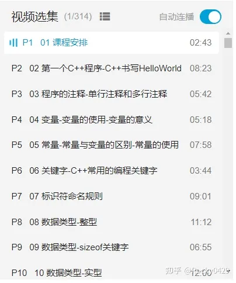

每一个阶段都会有相应的小项目教学，对初学者来说是很友好的。

[黑马程序员匠心之作|C++教程从0到1入门编程,学习编程不再难_哔哩哔哩_bilibiliwww.bilibili.com/video/av41559729?p=1](https://link.zhihu.com/?target=https%3A//www.bilibili.com/video/av41559729%3Fp%3D1)

**看视频的时候不是看看就过去了，编程毕竟是门一门手艺活，孰能生巧。**

**建议一边看，一边将视频中的示例或者小项目教学自己也实现一下，刚开始不会可以照着敲，比只看不动手强一百倍。**

### 2.书籍推荐

入门阶段的书籍为辅，怎么为辅呢？

就是**视频看完一个阶段，然后就可以去看书上对应阶段的内容，这样看书，一方面看书的时候会很快，容易理解，另一方面可以印证自己在看视频的时候一些不太理解的地方。**

入门阶段推荐两本书，一本薄的，一本厚的，都是超级经典的书籍。

**《Essential C++》**

《Essential C++》是一本内容不多但很实用的 C++ 入门书籍，这本书强调的是快速上手与理解 C++ 编程。

主要围绕一系列逐渐复杂的程序问题，以及用以解决这些问题的语言特性展开讲解。

你不只学到 C++ 的函数和结构，也会学习到它们的设计目的和基本原理。


**《C++ Primer》**

很多人 C++ 入门的时候会推荐《C++ Primer Plus》，但是我更强烈推荐的是这本《C++ Primer》！

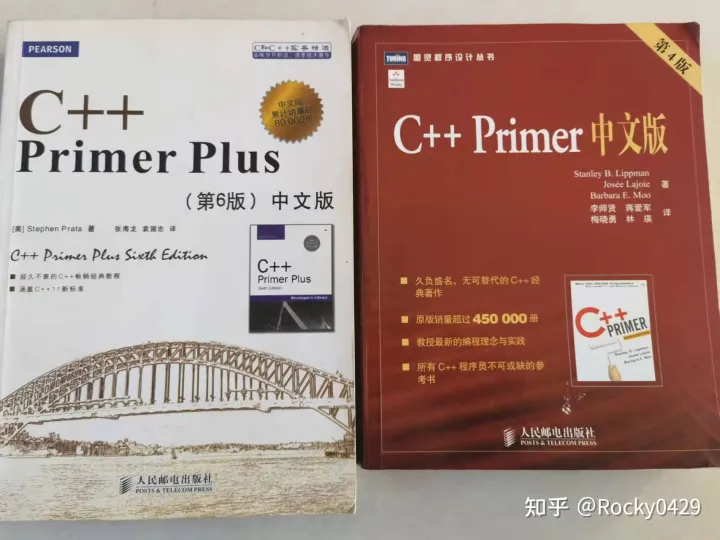

这两本书我都看过，很有发言权，当时我学习的时候《C++ Primer》还是第 4 版，现在都到第 5 版了！

《C++ Primer》堪称 C++ 语法学习的最权威书籍，非常全面地讲解了C++的语法以及C++11的各种新特性，看完之后真的帮助特别大！

如果有时间建议至少看两遍以上！时面向 C++ 语言的初学者，是一本很友好的自学教材！而且例程和习题丰富，相信认真读过之后，可以完成 C++ 语言入门这个目标！！

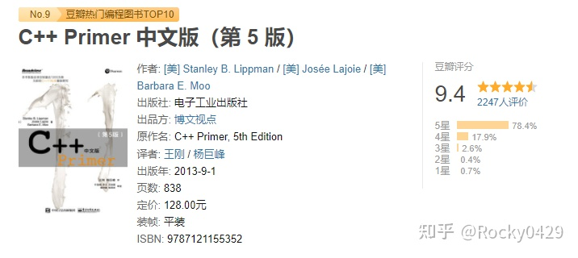

## **二、进阶阶段**

在进阶阶段，你已经对 C++ 有一定的认知了。

这个时候我们可以深入学习 C++ 标准模板库（STL）、设计模式、数据结构基础以及 UI 界面开发、数据库开发等高级技能。

### 1.书籍推荐

**《C++标准程序库》**

关于 STL，可以先读这本侯捷老师翻译的《C++ 标准程序库》。

通过这本书对STL有个基本认识，学会使用 STL。

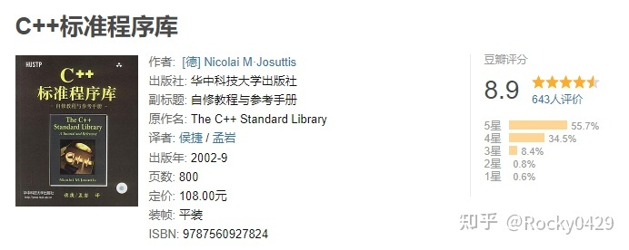

**《STL源码剖析》**

读完 《C++ 标准程序库》，就可以来读这本侯捷老师编写的《STL源码剖析》了。

这本书建议必读！

这本书讲解了 C++ 底层实现，主要包括 C++ 底层内存管理、各种容器的数据结构实现、常见算法的实现等。

可以帮助深入理解C++底层，同时也是对数据结构的复习和巩固。

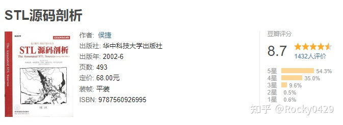

**《Effective C++》**

《Effective C++》讲了 C++ 编程的 55 条准则，提高你的 C++ 编程质量，也是侯捷老师翻译的！

这本书有助于梳理在编写 C++ 程序时的一些常见错误和注意事项，也是面试常考的。

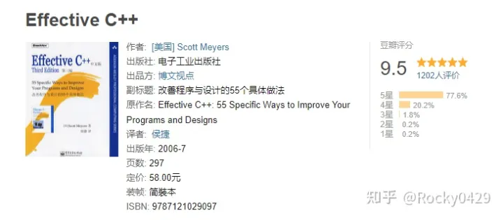

**《深度探索C++对象模型》**

《深度探索C++对象模型》这本书讲解了C++面向对象特性的底层实现机制。

侯捷老师翻译的，看完这本书，对C++面向对象的理解帮助极大，建议必读！


### 2.视频推荐

不知道大家注意了没，上面我推荐了四本书，都和一个人有关：侯捷老师。

书要么是他翻译的，要么是他写的，C++ 领域 YYDS！同意吧？

侯捷老师当然也有讲课，针对书都有对应内容的视频课程！

怎么样？香吧！原先这些课本来可以在 B 站看的，但是不知道为啥，都下架了，sad。

**我搜集了一套非常全的侯捷老师的 C++ 视频，有需要的可以去下载保存备用。**

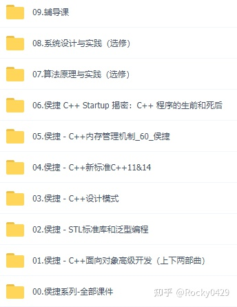

**视频地址：**

[侯捷 C++ 八步曲全套视频（含下载方式）mp.weixin.qq.com/s?__biz=MzI0NjAxMDU5NA==&mid=2475922860&idx=1&sn=2115db904d80e58532bf4533c60c31b8&chksm=ff22f221c8557b370dca60c4e209108be82156dbc957181d6de711e7cf1b4dbafa2bf753c0b5&token=1153516574&lang=zh_CN#rd](https://link.zhihu.com/?target=https%3A//mp.weixin.qq.com/s%3F__biz%3DMzI0NjAxMDU5NA%3D%3D%26mid%3D2475922860%26idx%3D1%26sn%3D2115db904d80e58532bf4533c60c31b8%26chksm%3Dff22f221c8557b370dca60c4e209108be82156dbc957181d6de711e7cf1b4dbafa2bf753c0b5%26token%3D1153516574%26lang%3Dzh_CN%23rd)

## **三、应用阶段**


其实编程语言就是要多练，怎么多练，就是代码量。

自己多写，然后多观摩别人的项目，看人家的写法，模仿项目，学习其中的思想，一点点的积累，一步步形成自己的东西，厚积而薄发，慢慢你就会发现你也可以了。

我在这里推荐几个非常优秀的 GitHub 上的实战项目。

**一共推荐 14 个开源项目，7 个入门级，7 个企业级**，保证都是值得学习的开源项目！

### **入门级**

**1.TinyWebServer（3.6k+ star）**

Linux下C++轻量级Web服务器，助力初学者快速实践网络编程，搭建属于自己的服务器.

- 使用 **线程池 + 非阻塞socket + epoll(ET和LT均实现) + 事件处理(Reactor和模拟Proactor均实现)** 的并发模型
- 使用**状态机**解析HTTP请求报文，支持解析**GET和POST**请求
- 访问服务器数据库实现web端用户**注册、登录**功能，可以请求服务器**图片和视频文件**
- 实现**同步/异步日志系统**，记录服务器运行状态
- 经Webbench压力测试可以实现**上万的并发连接**数据交换

> 传送门：[GitHub - qinguoyi/TinyWebServer: Linux下C++轻量级Web服务器](https://link.zhihu.com/?target=https%3A//github.com/qinguoyi/TinyWebServer)

**要想看懂顶尖开源代码，计算机经典书籍必须经常读起来。**

不仅能提升大家的技能能力和技术认知，更能在阅读真正经典的代码之际发挥巨大作用，我整理好了，大家自取。

[少走弯路，必读计算机经典书籍推荐（含下载方式）mp.weixin.qq.com/s?__biz=MzI0NjAxMDU5NA==&mid=328435236&idx=1&sn=f253bfb7a7263e0e2442f8f56c190b2d&chksm=7f22e1a9485568bfcb5c3bef151a38d7592160602d9563e1e4ba6fd11e235880047fc96ddab5#rdmp.weixin.qq.com/s?__biz=MzI0NjAxMDU5NA==&mid=328435236&idx=1&sn=f253bfb7a7263e0e2442f8f56c190b2d&chksm=7f22e1a9485568bfcb5c3bef151a38d7592160602d9563e1e4ba6fd11e235880047fc96ddab5#rdmp.weixin.qq.com/s?__biz=MzI0NjAxMDU5NA==&mid=328435236&idx=1&sn=f253bfb7a7263e0e2442f8f56c190b2d&chksm=7f22e1a9485568bfcb5c3bef151a38d7592160602d9563e1e4ba6fd11e235880047fc96ddab5#rdmp.weixin.qq.com/s?__biz=MzI0NjAxMDU5NA==&mid=328435236&idx=1&sn=f253bfb7a7263e0e2442f8f56c190b2d&chksm=7f22e1a9485568bfcb5c3bef151a38d7592160602d9563e1e4ba6fd11e235880047fc96ddab5#rd](https://link.zhihu.com/?target=https%3A//mp.weixin.qq.com/s%3F__biz%3DMzI0NjAxMDU5NA%3D%3D%26mid%3D328435236%26idx%3D1%26sn%3Df253bfb7a7263e0e2442f8f56c190b2d%26chksm%3D7f22e1a9485568bfcb5c3bef151a38d7592160602d9563e1e4ba6fd11e235880047fc96ddab5%23rd)

**2.libqalculate（545 star）**

使用 C++ 编写的多功能计算器桌面应用、库和 CLI 程序。

它易于使用功能强大，支持大型可定制函数库、单位计算和转换、符号计算（包括积分和方程）。

作为用户你可以直接在命令行中使用，作为开发者你也可以在自己的项目中使用这个库。官方还制作了[Qt](https://link.zhihu.com/?target=https%3A//github.com/Qalculate/qalculate-qt)和[GTK](https://link.zhihu.com/?target=https%3A//github.com/Qalculate/qalculate-gtk)两个版本的 GUI 计算器应用。


**3.spdlog（12.7k+）**

快速、上手简单的 C++ 日志库。示例代码：

```text
#include "spdlog/spdlog.h"

int main() 
{
    spdlog::info("Welcome to spdlog!");
    spdlog::error("Some error message with arg: {}", 1);

    spdlog::warn("Easy padding in numbers like {:08d}", 12);
    spdlog::critical("Support for int: {0:d};  hex: {0:x};  oct: {0:o}; bin: {0:b}", 42);
    spdlog::info("Support for floats {:03.2f}", 1.23456);
    spdlog::info("Positional args are {1} {0}..", "too", "supported");
    spdlog::info("{:<30}", "left aligned");

    spdlog::set_level(spdlog::level::debug); // Set global log level to debug
    spdlog::debug("This message should be displayed..");    

    // change log pattern
    spdlog::set_pattern("[%H:%M:%S %z] [%n] [%^---%L---%$] [thread %t] %v");

    // Compile time log levels
    // define SPDLOG_ACTIVE_LEVEL to desired level
    SPDLOG_TRACE("Some trace message with param {}", 42);
    SPDLOG_DEBUG("Some debug message");
}
```

**4.CPlusPlusThings（15.4k+star）**

这是一个适合 C++ 初学者从入门到进阶的教程。

解决了面试者想要深入 C++ 及如何入坑 C++ 的问题。

除此之外，该仓库拓展了更加深入的语法分析、多线程并发等的知识，是一个比较全面的 C++ 从入门学习到进阶提升的项目。

**5.indicators（1.7k+star）**

一个使用 C++ 编写的进度条库，你可以用它在命令行中实现美观的进度条。它使用方便、线程安全、支持多种进度条样式。

**6.sudoku（299 star）**

C++ 实现的命令行数独游戏。600 余行代码，初学者也可以轻松学习。

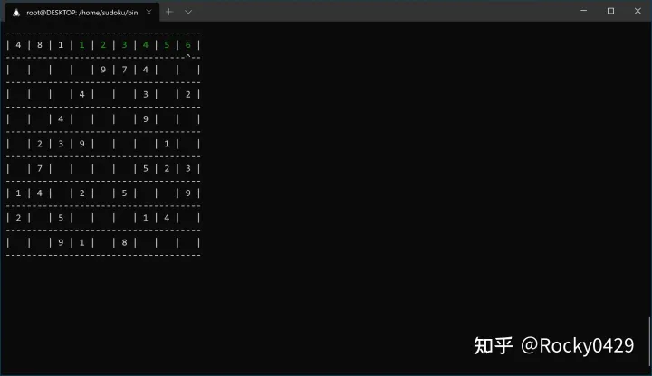

**7.dbg-macro（1.7k+）**

打日志是 C++ 开发中必不可少的一种 debug 方式，[dbg-macro](https://link.zhihu.com/?target=https%3A//github.com/sharkdp/dbg-macro) 受 [rust-lang](https://link.zhihu.com/?target=https%3A//www.rust-lang.org/) 中 的 [dbg](https://link.zhihu.com/?target=https%3A//doc.rust-lang.org/std/macro.dbg.html) 启发，提供比 printf 和 std::cout 更好的宏函数。主要有如下特点：

- 美观的彩色输出（当输出不是交互式终端时，颜色将自动禁用）
- 兼容 C++11，并且是 header-only
- 支持基础类型和 STL 容器类型的输出
- 除了基本信息外，还输出变量名和类型
- 启用 DBG*MACRO*DISABLE 生成 release 版

```text
#include <vector>
#include <dbg.h>

// You can use "dbg(..)" in expressions:
int factorial(int n) {
  if (dbg(n <= 1)) {
    return dbg(1);
  } else {
    return dbg(n * factorial(n - 1));
  }
}

int main() {
  std::string message = "hello";
  dbg(message);  // [example.cpp:15 (main)] message = "hello" (std::string)
  const int a = 2;
  const int b = dbg(3 * a) + 1;  // [example.cpp:18 (main)] 3 * a = 6 (int)
  std::vector<int> numbers{b, 13, 42};
  dbg(numbers);  // [example.cpp:21 (main)] numbers = {7, 13, 42} (size: 3) (std::vector<int>)
  dbg("this line is executed");  // [example.cpp:23 (main)] this line is executed
  factorial(4);
  return 0;
}
```


### **企业级**

**1.rocksdb（21.1k+ star）**

该项目是由 Fackbook 数据库团队基于 levelDB 开发，用 C++ 编写的高性能键值存储引擎。

键值均支持二进制流，能够充分利用多核 CPU 获得高性能，并兼容 levelDB 的 API 可谓是青出于蓝而胜于蓝。RocksDB 当下十分流行，一些开源数据库底层存储用的就是它。

> 传送门：[https://github.com/facebook/rocksdb](https://link.zhihu.com/?target=https%3A//github.com/facebook/rocksdb)

**要想看懂顶尖开源代码，计算机经典书籍必须经常读起来。**

不仅能提升大家的技能能力和技术认知，更能在阅读真正经典的代码之际发挥巨大作用，我整理好了，大家自取。

[少走弯路，必读计算机经典书籍推荐（含下载方式）mp.weixin.qq.com/s?__biz=MzI0NjAxMDU5NA==&mid=328435236&idx=1&sn=f253bfb7a7263e0e2442f8f56c190b2d&chksm=7f22e1a9485568bfcb5c3bef151a38d7592160602d9563e1e4ba6fd11e235880047fc96ddab5#rdmp.weixin.qq.com/s?__biz=MzI0NjAxMDU5NA==&mid=328435236&idx=1&sn=f253bfb7a7263e0e2442f8f56c190b2d&chksm=7f22e1a9485568bfcb5c3bef151a38d7592160602d9563e1e4ba6fd11e235880047fc96ddab5#rdmp.weixin.qq.com/s?__biz=MzI0NjAxMDU5NA==&mid=328435236&idx=1&sn=f253bfb7a7263e0e2442f8f56c190b2d&chksm=7f22e1a9485568bfcb5c3bef151a38d7592160602d9563e1e4ba6fd11e235880047fc96ddab5#rd](https://link.zhihu.com/?target=https%3A//mp.weixin.qq.com/s%3F__biz%3DMzI0NjAxMDU5NA%3D%3D%26mid%3D328435236%26idx%3D1%26sn%3Df253bfb7a7263e0e2442f8f56c190b2d%26chksm%3D7f22e1a9485568bfcb5c3bef151a38d7592160602d9563e1e4ba6fd11e235880047fc96ddab5%23rd)

**2.winmerge（2.2k+ star）**

一个用 C++ 编写的 Windows 比较和合并工具。

它可以比较文件和文件夹，以直观的可视化格式来显示两者甚至三者之间的差异，操作简单。

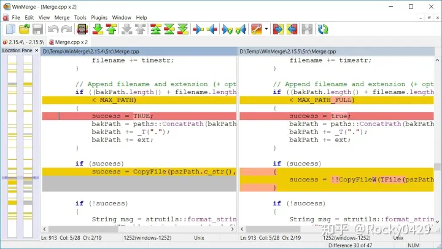

> 传送门：[GitHub - WinMerge/winmerge: WinMerge is an Open Source differencing and merging tool for Windows. WinMerge can compare both folders and files, presenting differences in a visual text format that is easy to understand and handle.](https://link.zhihu.com/?target=https%3A//github.com/WinMerge/winmerge)

**3.workflow（6.1k+ star）**

搜狗开源的 C++ 服务器引擎。

支撑搜狗几乎所有后端 C++ 在线服务：

- 所有搜索服务
- 云输入法
- 广告
- ....

每日处理超百亿请求。

这是一个设计轻盈优雅的企业级程序引擎，可以满足大多数 C++ 后端开发需求。

> 传送门：[https://github.com/sogou/workflow](https://link.zhihu.com/?target=https%3A//github.com/sogou/workflow)

**4.srpc（825 star）**

搜狗基于 C++ Workflow 的高性能 RPC 框架。

与 thrift/brpc 协议兼容，支持 protobuf/thrift IDL一键迁移，核心代码量仅 1w 行。


> 传送门：[GitHub - sogou/srpc: RPC based on C++ Workflow. Supports Baidu bRPC, Tencent tRPC, thrift protocols.](https://link.zhihu.com/?target=https%3A//github.com/sogou/srpc)

**5.nvui（1.2k+ star）**

跨平台现代的 Neovim 前端。

它使用起来流畅，动画效果细腻、美观，你可以用 Neovim 和 nvui 自由定制出一个高颜值、最懂你的编辑器。

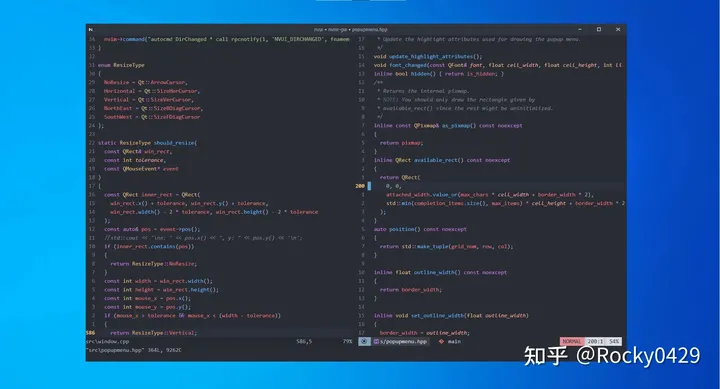

> 传送门：[https://github.com/rohit-px2/nvui](https://link.zhihu.com/?target=https%3A//github.com/rohit-px2/nvui)

**6.filament（12.1k+ star）**

filament 是轻量级实时物理渲染引擎。

能够用来做游戏渲染引擎或者音视频编辑工程，当你需要处理 3D 渲染效果，又不想引入庞大的游戏引擎时，可以考虑使用它尤其是 Android 平台。


> 传送门：[GitHub - google/filament: Filament is a real-time physically based rendering engine for Android, iOS, Windows, Linux, macOS, and WebGL2](https://link.zhihu.com/?target=https%3A//github.com/google/filament)

**7.hplayer（451 star）**

一个基于 C++ 实现的多画面播放器。

能播放文件源、网络源、设备捕获源，界面为多画面监控网格，可自由切换多画面风格，支持拖拽与合并。适合想要入门音视频、播放器开发的小伙伴们学习，该项目用到的技术栈：

- Qt 实现界面
- FFmpeg 获取帧、编解码、转码
- OpenCV 处理图片
- OpenGL 渲染视频帧

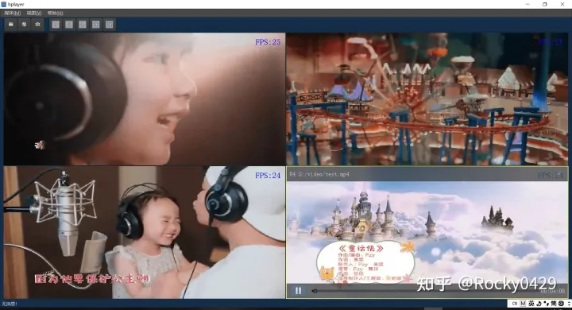

> 传送门：[https://github.com/ithewei/hpla](https://link.zhihu.com/?target=https%3A//github.com/ithewei/hplayer)

## 希望对你有所帮助

其实说实话，本科的同学 C++ 水平真是天差地別的。

你能学到什么程度，就看你的努力程度了。

最后再送给学习 C++ 的同学一段浙大翁凯老师讲课说的话：

> 学 C++ (计算机)一定要有一个非常强大的心理状态。
> 为什么呢？
> C++ （计算机）的所有东西都是人做出来的，别人能想出来的我也一定想得出来，在 C++（计算机）里头没有任何黑魔法，所有的东西只不过是我现在不知道而已。
> 总有一天我会把它里面的细节搞明白的！

大家加油！